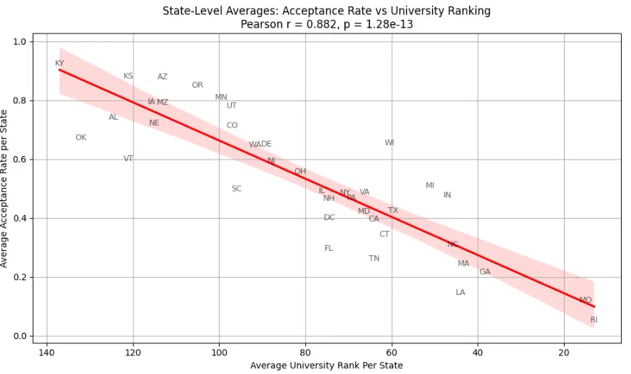
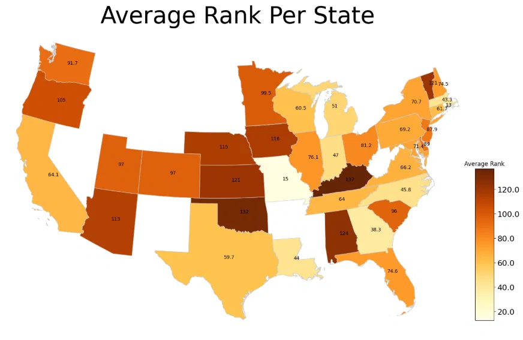
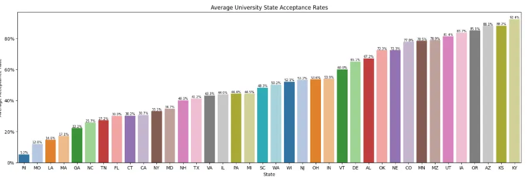

# University Admissions Prestige Analysis

Does the presence of highly ranked universities in a U.S. state correlate 
with lower overall college acceptance rates? This project investigates that 
question using 40 years of national rankings data and federal admissions records.

## Research Question

Does the average institutional prestige of universities in a U.S. state — 
measured by mean U.S. News & World Report national ranking — predict lower 
state-level acceptance rates?

## Key Findings

- Discovered a strong positive correlation (Pearson r = 0.882, p = 1.28e-13) 
  between average institutional rank and state-level acceptance rates — states 
  with more prestigious universities tend to have significantly lower acceptance 
  rates overall
- Rhode Island, home to Brown University, had the lowest acceptance rate (11%) 
  and highest average prestige of any state
- Kentucky had the highest average acceptance rate (92%) with the lowest 
  average prestige
- The relationship is not uniform across all states — population size and 
  application volume introduce notable variation

## Visualizations

### State-Level Acceptance Rate vs. University Ranking

### Average Rank Per State

### Average Acceptance Rate by State

## Datasets

- **U.S. News College Rankings (1984–2025)** — 40 years of national university 
  rankings used to measure institutional prestige by state
- **IPEDS Admissions Data (Fall 2023)** — Federal dataset containing 
  applications, acceptances, and enrollment figures for U.S. institutions

## Tech Stack

## How to Run

    git clone https://github.com/hamzahmansuri/university-admissions-analysis
    cd university-admissions-analysis
    pip install pandas matplotlib seaborn scipy jupyter
    jupyter notebook FinalProject_Group059_SP25.ipynb

## Project Structure

    ├── Data/                            # Raw datasets (IPEDS + US News)
    ├── DataCheckpoint_Group059.ipynb    # Data cleaning and wrangling
    ├── EDACheckpoint_Group059.ipynb     # Exploratory data analysis
    ├── FinalProject_Group059.ipynb      # Full analysis and findings
    └── ProjectProposal_Group059.ipynb   # Original research proposal

## Contributors

Collaborative project completed as part of COGS 108 (Data Science in Practice) 
at UC San Diego, Spring 2025.

- **Hamzah Mansuri** — hypothesis design, background research, scatter plot 
  analysis with regression, iterative improvements across checkpoints
- Lukas Fullner, Jiahao Han, Daniel Lee, Jason Trinh